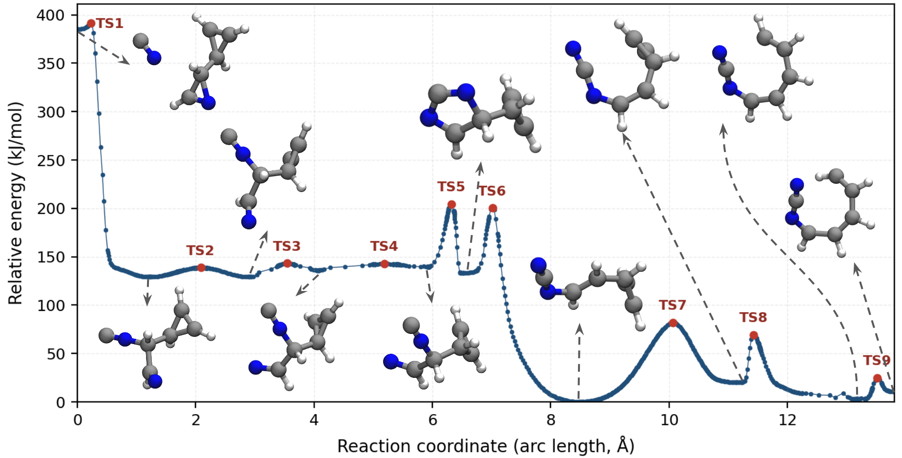
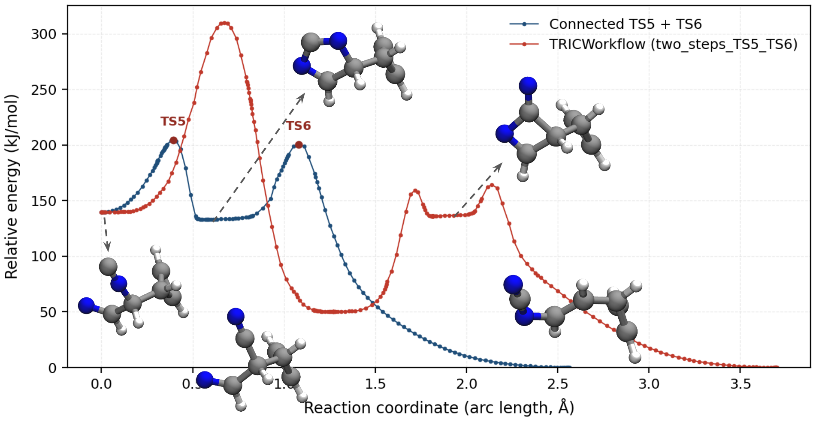

# TRICFlow

**TRICFlow is a geomeTRIC reaction-discovery workflow** built on translation–rotation internal coordinates (TRIC). To run it, you need only two inputs: a multi-frame XYZ file with reactant and product structures (frame 0 and frame −1), and a QM input file (method, basis, charge, multiplicity, etc.). The endpoints are re-optimized at the start of the workflow before pathway discovery begins; rough guesses are fine.

TRICFlow is built on geomeTRIC and is compatible with all QM engines supported by geomeTRIC (e.g. Psi4, Q-Chem, TeraChem, Gaussian, Molpro, and others), selected via `qm_program` in the API or `--qm-program` on the CLI.

Given two endpoint minima, TRICFlow automatically finds and refines the minimum-energy pathway connecting them by chaining elementary steps: endpoint optimization, TRICS interpolation, NEB, transition-state optimization, and IRC—with post-optimization and trajectory concatenation at each barrier-crossing segment.

The high-level driver is `TRICWorkflow` in `tricflow.tricflow` (Python API only—there is no CLI for the full discovery workflow). Individual calculation stages are exposed as Python functions and CLI commands for step-by-step use.

Performance note: NEB and Hessian calculations are the main bottlenecks because the workflow runs sequentially by default. This can be mitigated by using geomeTRIC's Work Queue or BigChem backends to parallelize independent gradient and Hessian evaluations across a cluster. See the [CCTools installation guide](https://geometric.readthedocs.io/en/latest/install.html#installation-of-cctools) in the geomeTRIC documentation.

---

## geomeTRIC compatibility

TRICFlow targets [geomeTRIC](https://github.com/leeping/geomeTRIC) v1.2.0 or later, which will include TRICS interpolation this workflow relies on.

Before that release, install geomeTRIC from the development branch instead of `pip` or `conda`:

```shell
git clone -b interpolate https://github.com/hjnpark/geomeTRIC.git
cd geomeTRIC
pip install -e .
```

---

## Installation

### 1. Create the conda environment

```shell
conda update conda
conda env create -f environment.yml
conda activate tricflow
```

or

```shell
conda update conda
conda config --add channel conda-forge
conda config --add channel psi4/label/dev
conda create --name tricflow --file requirements.txt
conda activate tricflow
```

### 2. Install geomeTRIC (see above)

Clone and install from the [`interpolate`](https://github.com/hjnpark/geomeTRIC/tree/interpolate) branch.

### 3. Install TRICFlow

```shell
pip install -e .
```

---

## Full workflow: `TRICWorkflow`

`TRICWorkflow` is available through the Python API (`from tricflow import TRICWorkflow`). It is not exposed as a CLI command; use the per-stage CLIs in `example/individual_steps/CLI/` only for isolated optimizations, NEB, TS, or IRC runs.

`TRICWorkflow` discovers a complete reaction pathway between two input minima. The workflow:

1. Optimizes the two frames in the input XYZ and writes `optimized_endpoints.xyz`.
2. Repeats an elementary-step cycle until the pathway connects the dynamic targets `a` and `b`:
   - TRICS interpolation between the current segment endpoints
   - NEB (or the converged NEB chain directly when there is no barrier)
   - TS optimization when a climbing image is found
   - IRC from the optimized TS, using the TS Hessian in the full workflow
   - Post-optimization of both IRC endpoints (`postopt=True`), then concatenation of the full optimization trajectories at each minimum with the IRC path (reactant opt → IRC → product opt)
3. Concatenates multiple elementary segments when more than one barrier is discovered.
4. Writes `full_pathway.xyz` under `work_dir`.

### Dynamic targets `a` and `b`

The targets are not fixed labels on the original input frames. They start as the optimized reactant (frame 0) and product (frame −1), but update as the pathway grows:

- When both IRC endpoints match the current targets (within `rmsd_threshold`, default 0.1 Å), that elementary segment is accepted and the workflow is complete.
- When one IRC endpoint matches a target (say `ep0 → a`), the matched label moves to the other IRC end (`a` becomes `ep1`), while the unmatched label keeps pointing at the other initially optimized structure (`b`) until it is matched in a later step. The workflow then launches another elementary step from the junction toward the still-unmatched minimum.
- The workflow only finishes when both ends of the latest IRC match the current dynamic `a` and `b`.

### Orienting segments when endpoints do not match

If a newly discovered IRC segment's endpoints do not yet match `a` and `b`, TRICFlow orients the trajectory before extending the pathway:

- Both ends match but reversed (`ep0 → b`, `ep1 → a`): the trajectory is flipped so it runs `a → b`.
- Neither end matches: TRICFlow compares TRIC primitive internal coordinate (PIC) topology at the IRC endpoints against the optimized endpoint frames. Endpoint-unique primitives are scored for direct (`ep0→a`, `ep1→b`) vs flipped (`ep0→b`, `ep1→a`) assignment. When both IRC endpoints share the same PIC topology (no endpoint-unique primitives), topology alone cannot distinguish the orientation; in that case TRICFlow compares `Angle` primitive values at each end against the targets and picks the lower-deviation assignment. The winning orientation is used, then missing directions are refined recursively.
- One end matches: the segment is oriented at the junction frame and concatenated with the next elementary step.

Set `verbose=1` to log PIC topology scores or angle-based costs during orientation.

### Example script

See `example/full_workflow/single_step_cases/single_step_TS1/run.py`:

```python
from pathlib import Path

from tricflow import TRICWorkflow

here = Path(__file__).parent

workflow = TRICWorkflow(
    here / "psi4.in",
    work_dir=here,
    qm_program="psi4",
    nt=4,
    rmsd_threshold=0.1,
    max_depth=10,
    neb={"n_images": 21, "maxg": 0.05, "avgg": 0.025, "plain": 1},
    opt={},
    ts={"converge": "set GAU_TIGHT"},
    irc={"converge": "set GAU_LOOSE"},
    interp={"n_images": 50},
)

pathway = workflow.run(here / "initial.xyz")
print(f"Done. Full pathway has {len(pathway.xyzs)} frames.")
```

Pass geomeTRIC options per stage via the `neb`, `opt`, `ts`, `irc`, and `interp` dicts (e.g. `neb={"maxg": 0.05, "avgg": 0.025}` for NEB convergence thresholds in eV/Å).

---

## Caching and resuming workflows

TRICFlow caches geomeTRIC results on disk so interrupted runs can be resumed without redoing converged work. Caching is enabled at every stage:

| Stage | Cache location (under `work_dir`) |
|-------|-----------------------------------|
| Endpoint optimization | `opt_runs/frame_*`, `optimized_endpoints.xyz` |
| Elementary step *N* | `step_{N:02d}/` — `endpoints.xyz`, `interpolated.xyz`, `neb_run/`, `ts_run/`, `irc_run/` |

A prior calculation is reused when:

- Its log shows a convergence marker (e.g. `Converged!` for optimizations, or the corresponding marker for NEB/IRC/interpolation).
- The input coordinates still match (same `initial.xyz` frames, or unchanged `step_XX/endpoints.xyz`).
- The QM method, basis, charge, and multiplicity are unchanged between the cached input file in the run directory and your current QM input template.

If method, basis, charge, or multiplicity change, TRICFlow treats the cache as invalid and renames the conflicting run directory (e.g. `neb_run` → `neb_run_0`) before starting fresh.

Other geomeTRIC options (coordinate system, convergence criteria, `maxiter`, NEB thresholds, etc.) may differ from the cached run; converged steps are still reused as long as the level of theory and charge/mult stay the same. If a prior run did not converge and the requested command is unchanged, TRICFlow raises an error instead of repeating the same failed calculation—delete or rename that run directory to force a retry.

### Resuming with `run.py`

To resume a workflow, re-run the same `run.py` with the same `work_dir` and unchanged endpoint coordinates in `initial.xyz`. Keep the same method, basis, charge, and multiplicity in your QM input file; you may edit other keywords (e.g. `set maxiter`) without invalidating the cache.

```python
workflow = TRICWorkflow(
    here / "psi4.in",       # same method / basis / charge / mult as the interrupted run
    work_dir=here,          # must point at the directory that already contains opt_runs/, step_00/, ...
    qm_program="psi4",
    nt=4,
    verbose=1,              # optional: print cache reuse and command details
    # neb, opt, ts, irc, interp kwargs may be tuned for steps not yet converged
)

pathway = workflow.run(here / "initial.xyz")   # same reactant/product coordinates as before
```

Completed elementary steps are loaded from `step_XX/irc_run/` (including IRC post-optimization when present). The workflow continues from the first incomplete step. Set `verbose=1` to see messages such as `Reusing cached optimized endpoints` or `Reusing cached elementary step (IRC + post-opt)`.

To start over entirely, use a new `work_dir` or remove the cached directories. To retry a failed step with different settings, delete or rename that step's subdirectory (e.g. `step_00/neb_run/`) before re-running.

---

## Test cases (`example/full_workflow/`)

The workflow has been exercised on a set of gas-phase test reactions (TS1–TS9) derived from a shared potential-energy surface.

### TS1–TS9 on the full PES



An example PES with elementary steps obtained using TRICFlow for a reaction between a CN radical and 3-(cycloprop-2-en-1-yl)-2H-azirine. Energies were calculated at the B3LYP/6-31G(d) level of theory.

| Case | Directory | Steps |
|------|-----------|-------|
| Single elementary steps | `single_step_cases/single_step_TS1` … `single_step_TS9` | 1 |
| Two-step pathways | `two_step_cases/two_steps_TS2_TS3`, `two_steps_TS3_TS4`, … | 2 |
| Three-step attempts | `three_step_cases/three_steps_*_failed` | 3 (did not complete) |

Single-step and two-step cases in `example/full_workflow/` have been run successfully. Reactions requiring more than two elementary steps (the `three_step_cases/*_failed` directories) did not complete with the current workflow logic—those cases are kept as references for future development. The failures most likely stem from insufficient NEB image resolution as the arc length along the pathway grows. Energy-weighted NEB or using a larger number of images (> 21) may mitigate this issue.

### Alternative path: `two_steps_TS5_TS6`

Connecting TS5's reactant to TS6's product (`two_step_cases/two_steps_TS5_TS6/`) discovers an alternative three-step route with a higher energy barrier than the sequential TS5 → TS6 pathway on the same surface:



---

## Individual calculation steps (`example/individual_steps/`)

Each stage of the workflow can be run standalone through Python APIs or CLI wrappers. See `example/individual_steps/API/run.py` for a full HCN example (optimize → interpolate → NEB → TS opt → IRC with post-opt), and `example/individual_steps/CLI/` for shell commands.

| CLI command | Purpose |
|-------------|---------|
| `tricflow-optimize` | Optimize frames in a multi-frame XYZ |
| `tricflow-neb` | Run NEB; TS optimization if a climbing image is found |
| `tricflow-tsoptimize` | Transition-state optimization (`--hessian first+last`) |
| `tricflow-irc` | IRC from an optimized TS with endpoint post-optimization |
| `tricflow-energies` | Single-point QM energies for each frame in an XYZ trajectory |
| `tricflow-assemble` | Assemble pre-computed pathway segments (see below) |

Python entry points: `optimize_frames`, `interpolate`, `run_neb`, `optimize_ts`, `run_irc`, `run_irc_postopt`, `get_energies`, and related helpers in `tricflow`.

Note: `tricflow-irc` calculates the Hessian at the TS geometry by default. The full `TRICWorkflow` passes the Hessian file from the preceding TS optimization.

---

## Single-point energies (`example/get_energies/`)

`get_energies` evaluates QM single-point energies (Hartree) for every frame in an XYZ trajectory without re-optimizing geometries—useful for plotting energy profiles along an interpolated or NEB path.

API (`example/get_energies/run.py`):

```python
from tricflow import get_energies

energies = get_energies(
    "psi4_HCN.in",
    "hcn_neb_input.xyz",
    qm_program="psi4",
    nt=4,
    work_dir=".",
)
```

CLI (`example/get_energies/command.sh`):

```shell
tricflow-energies hcn_neb_input.xyz --input-file psi4_HCN.in --run-dir . --nt 4 -o energies.json
```

Results are written to `energies.json` (or the path given with `-o`).

---

## Assembling pathway segments (`example/assemble_paths/`)

When elementary steps are computed separately, `assemble_pathways` connects multi-frame XYZ segments by junction aligned RMSD. Segment order among inputs need not be specified—connectivity is inferred, and segments may be reversed automatically.

API (`example/assemble_paths/API/run.py`):

```python
from tricflow import assemble_pathways

results = assemble_pathways(
    ["TS3_path.xyz", "TS4_path.xyz", "TS5_path.xyz", "TS6_path.xyz"],
    rmsd_threshold=0.1,
)
pathway = results[0]["pathway"]
pathway.write("full_pathway.xyz")
```

CLI (`example/assemble_paths/CLI/command.sh`):

```shell
tricflow-assemble TS3_path.xyz TS4_path.xyz TS5_path.xyz TS6_path.xyz -o full_pathway.xyz
```

---

## Future work

1. More engine examples — worked examples using Q-Chem, TeraChem, Gaussian, and other geomeTRIC-supported packages (current examples use Psi4).
2. Basin-detection workflow — optimize all frames along an interpolated path to locate energy basins, then run the refinement workflow to connect those minima.
3. QCFractal integration — enable the refinement workflow through QCFractal to parallelize elementary steps across compute resources and store results in a database.

---

## Acknowledgments

Parts of TRICFlow—including workflow logic, CLI tooling, tests, and documentation—were developed with assistance from Grok Build.

TRICFlow evolved from QCArchive Reaction Workflow (QCARWorkflow).

### References

1. Wang, L.-P.; McGibbon, R. T.; Pande, V. S.; Martinez, T. J. Automated Discovery and Refinement of Reactive Molecular Dynamics Pathways. *J. Chem. Theory Comput.* **2016**, *12*(2), 638–649. [https://pubs.acs.org/doi/abs/10.1021/acs.jctc.5b00830](https://pubs.acs.org/doi/abs/10.1021/acs.jctc.5b00830)
2. Wang, L.-P.; Song, C. Geometry Optimization Made Simple with Translation and Rotation Coordinates. *J. Chem. Phys.* **2016**, *144*(21), 214108. [https://doi.org/10.1063/1.4952956](https://doi.org/10.1063/1.4952956)
3. Park, H.; Pritchard, B. P.; Wang, L.-P. High-Throughput Approach for Minimum Energy Pathway Search Using the Nudged Elastic Band Method with Efficient Data Handling and Parallel Computing. *J. Chem. Theory Comput.* **2025**, *21*, 12048. [https://doi.org/10.1021/acs.jctc.5c01540](https://doi.org/10.1021/acs.jctc.5c01540)
4. Henkelman, G.; Uberuaga, B. P.; Jonsson, H. A climbing image nudged elastic band method for finding saddle points and minimum energy paths. *J. Chem. Phys.* **2000**, *113*(22). [https://doi.org/10.1063/1.1329672](https://doi.org/10.1063/1.1329672)
5. Gonzalez, C.; Schlegel, H. B. An improved algorithm for reaction path following. *J. Chem. Phys.* **1989**, *90*(4), 2154–2161. [https://doi.org/10.1063/1.456010](https://doi.org/10.1063/1.456010)